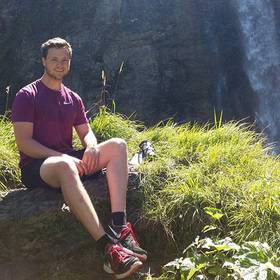

Max Planck Institute for Evolutionary Anthropology

Department of Human Behavior, Ecology and Culture

Deutscher Platz 6

04103 Leipzig

phone: +49 (341) 3550 - 315

 
If you have any further questions regarding the workshop, please email us at eslr2019@eva.mpg.de or find us on twitter [ESLR2019](https://twitter.com/ESLR2019).

 

  

**Dominik Deffner**

 

  

**Han Tran**

 

  

**Natalia Federova**

 

 

**Riana Minocher**

 

**Arianna Dalzero**

